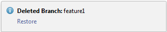

# Ever wanted to use git without the command line?
This article focuses on WebStorm which is an IDE created by the wonderful folks at JetBrains. The IDE provides great functional tools for web development such as git integration which will be discussed in this article. This article assumes the reader is familiar with git concepts including forking and rebasing. If these terms are unfamiliar try reading [git basics](https://git-scm.com/book/en/v2/Getting-Started-Git-Basics).

## Rangle Git Flow
At Rangle we focus on effective code management throughout a project's development cycle. In order to manage code effectively it is important to follow a few guidelines:

1. Start by forking project  
2. Create a new branch for each feature or bug fix
3. Make pull request for each change

# WebStorm Git Flow

## Forking a remote repository
Within Github or Bitbucket find the project you will be working with and create a fork.

## How to sync a fork to a remote repository

Do the following:

1. From the main menu, choose **VCS | Git | Remotes**. The Git Remotes dialog will open.
2. Click the **Add** button ```+``` on the toolbar or press ```⌘N```.
3. In the dialog that opens, specify the remote name and URL and click ***OK***.


## [How to Rebase within Webstorm](https://www.jetbrains.com/help/webstorm/2016.3/rebasing-branches.html) 
Git integration with WebStorm supports the Rebase operation and provides an interface that ensures high flexibility in setting the rebase arguments.

The following functionality is supported:
- The **basic use case** which [involves applying a branch on top](https://www.jetbrains.com/help/webstorm/2016.3/applying-a-branch-entirely-on-top-of-master.html) of the current HEAD of the master after synchronization with the upstream.
- Rebasing a branch entirely or partially to a [specific commit](https://www.jetbrains.com/help/webstorm/2016.3/rebasing-a-branch-to-a-specific-commit.html) in any branch or tag.
- Running rebase on several local repositories simultaneously.
- Selecting a merge strategy to apply, with the possibility to use no merging strategy at all.
- Running [rebase interactively](https://www.jetbrains.com/help/webstorm/2016.3/interactive-rebase.html) with control over preserving/squashing merges.
- Resuming interrupted rebase after merge conflicts are resolved.
- Cancelling rebase.

### To initiate a rebase operation

1. From the main menu, select **VCS | Git | Rebase**. The [Rebase Branches](https://www.jetbrains.com/help/webstorm/2016.3/rebase-branches-dialog.html) dialog box opens.
2. From the **Git Root** drop-down list, select the relevant local repository.
3. From the **Branch** drop-down list, select the branch you want to rebase. By default, the current branch is selected. If you specify a different branch, it will be checked out.
4. Specify the new base and the commits you want to apply.
5. If necessary, choose a rebase strategy and click **Rebase**.

The ```rebase``` command is also available from the [Git Branches popup](https://www.jetbrains.com/help/webstorm/2016.3/accessing-git-branches-popup-menu.html) in the submenu for the selected branch.

### To resume an interrupted rebase operation

- From the main menu, choose **VCS | Git | Continue Rebasing**.

    Before resuming the rebase operation, view the log in the Version Control tool window.

If rebase was initiated and interrupted on two or more local repositories, the **Continue Rebasing** dialog box is displayed. Select the repository on which you want to resume the rebase operation from the **Git Root** drop-down list.

### To cancel a rebase operation

- From the main menu, choose **VCS | Git | Abort Rebasing**.

If rebase was initiated on two or more local repositories, the **Abort Rebasing** dialog box is displayed. Select the repository on which you want to cancel the rebase operation from the **Git Root** drop-down list.

## [Creating a new branch](https://www.jetbrains.com/help/webstorm/2016.3/creating-a-new-branch.html)
Creating new branches is important for keeping a clean development cycle. Without overlapping features it become easy to isolate problems without compromising any other work done.


### To create a new Git branch
1. Invoke the **Branches** menu as described in [Accessing Git Branches Popup Menu](https://www.jetbrains.com/help/webstorm/2016.3/accessing-git-branches-popup-menu.html).
2. In the pop-up menu, choose New Branch.
3. In the **Create new branch** dialog box, specify the branch name. The branch with the specified name will be checked out (corresponds to `git checkout -b`).

### To check out a new Git branch from a local branch
1. Invoke the **Branches** menu as described in [Accessing Git Branches Popup Menu](https://www.jetbrains.com/help/webstorm/2016.3/accessing-git-branches-popup-menu.html).
2. Select a branch in the pop-up list that shows all available local and remote branches, and choose **Checkout as new branch** from the submenu.
3. Specify the branch name in the **Create new branch** dialog that opens.

### To check out a new local branch from a remote branch
1. Invoke the Branches menu as described in [Accessing Git Branches Popup Menu](https://www.jetbrains.com/help/webstorm/2016.3/accessing-git-branches-popup-menu.html).
2. Select a branch in the pop-up list that shows all available local and remote branches, and choose **Checkout as new local branch** from the submenu.
3. Specify the name of the new branch in the **Checkout new branch from <branch name>** dialog that opens.
The branch with the specified name will be checked out and put under version control.

## [Creating a Pull Request](https://www.jetbrains.com/help/webstorm/2016.3/creating-a-pull-request.html)

Creating [pull requests](https://help.github.com/articles/about-pull-requests/) is a nice way to follow the collaborative development workflow. With it you can tell others about the changes you’ve made and ask for comments, review, or just share the knowledge. With all this going on, a pull request appears in the original repository only after approval. A pull request can be prepared right from WebStorm without switching to the browser.

### To create a pull request:

1. On the main menu, choose **VCS | Git | Create Pull Request**. The **Create Pull Request** dialog box opens.
2. In the **Base Form** field, specify the repository to apply the changes to. WebStorm attempts to retrieve all the relevant repositories and shows them in the drop-down list. Choose the repository from the drop-down list or click **Select Other Fork** and from the **Form Owner** drop-down list choose the name of the user who is the owner of the target repository.
3. In the **Base Branch** field, specify the branch to apply the changes to. Click **Show Diff** to view the list of commits to be included in the pull request. To view the details of a commit, select it and switch to the **Log** tab which shows a list of files included in the selected commit list. See also [Merging, Deleting, and Comparing Branches](https://www.jetbrains.com/help/webstorm/2016.3/merging-deleting-and-comparing-branches.html).
4. In the **Title** field, specify the name for your request.
5. In the **Description** field, optionally provide a brief description of the changes to be applied through the request.


## How to Groom Branches

### To merge a branch

1. Invoke the **Branches** menu as described in [Accessing Git Branches Popup Menu](https://www.jetbrains.com/help/webstorm/2016.3/accessing-git-branches-popup-menu.html).
2. Select a branch in the pop-up list that shows all available local and remote branches, and choose **Merge** from the submenu. The selected branch will be merged into the branch that is currently [checked out](https://www.jetbrains.com/help/webstorm/2016.3/checking-out-switching-between-branches.html).

If there are merge conflicts, you will be prompted to resolve them.

If your local changes are going to be overwritten by merge, WebStorm suggests to perform **Smart Merge** (similar to [smart checkout](https://www.jetbrains.com/help/webstorm/2016.3/checking-out-switching-between-branches.html)).

### To delete a branch

1. Invoke the **Branches** menu as described in [Accessing Git Branches Popup Menu](https://www.jetbrains.com/help/webstorm/2016.3/accessing-git-branches-popup-menu.html).
2. Select a branch in the pop-up list that shows all available local and remote branches, and choose **Delete** from the submenu.
After you have deleted a branch, a notification will be displayed in the bottom right corner from which you can restore the deleted branch:



If the deleted branch contained commits that have not yet been merged to its upstream branch or to the current branch, it will still be deleted immediately (equivalent to the ```git branch --D``` or ```git branch --delete --force``` command), but the notification will also contain a link allowing you to view the unmerged commits.

If the deleted branch was tracking a remote branch, you will also be able to remove the remote branch from this notification.

### To compare branches

1. Invoke the **Branches** menu as described in [Accessing Git Branches Popup Menu](https://www.jetbrains.com/help/webstorm/2016.3/accessing-git-branches-popup-menu.html).
2. Select a branch in the pop-up list that shows all available local and remote branches, and choose **Compare** from the submenu.
    WebStorm compares the branch that is [currently checked out](https://www.jetbrains.com/help/webstorm/2016.3/checking-out-switching-between-branches.html#current) with the selected branch.
3. In the dialog that opens, compare the differences in the following two tabs:
- **Log**: this tab lists the commits that exist in the current branch, and are missing in the selected branch, and vice versa.
- **Diff**: this tab shows the differences between files existing in both branches. Use the [Show Diff](https://www.jetbrains.com/help/webstorm/2016.3/comparing-files.html) command on the context menu of a file to explore the differences between branches.

# Conclusion

This article covered the basic git functionality we use at Rangle.io within WebStorm IDE. We looked at how to conduct basic functions such as adding remotes, creating new branches, creating pull requests, rebasing and grooming git. Remember, most of these functionalities can be accessed through the bottom right corner of WebStorm through the [Git Branches Popup Menu](https://www.jetbrains.com/help/webstorm/2016.3/accessing-git-branches-popup-menu.html). To get familiar with the follow it is important follow to practice the process. Good luck!